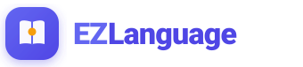

# 📘 EZLanguage — Personal Smart English Notebook & Flashcard Companion

<p align="center">
  
</p>

<p align="center">
  <strong>A premium, offline-first Progressive Web App (PWA) tailored specifically for personal English vocabulary curation, active recall, and spaced learning on iOS and modern web browsers.</strong>
</p>

<p align="center">
  
  
  
  
  
  
</p>

---

## 🎯 About The Project

**EZLanguage** is a bespoke, **personal-use language learning application** built to eliminate the clutter and friction of generic dictionary platforms. It serves as an intelligent digital pocket notebook to curate, organize, and master English vocabulary, phrasal verbs, idioms, collocations, grammar sentence patterns, and common language mistakes.

Engineered with a **Local-First, Cloud-Synced** architecture, it provides an ultra-responsive native app feel on mobile devices (PWA Standalone) with real-time cloud persistence, native audio pronunciation, multi-source definitions, and 3D flashcard reviews.

---

## ✨ Core Features

### 🔍 1. Multi-Engine Quick Lookup
- **Parallel Querying**: Simultaneously taps into Google Translate Engine, Free Dictionary (Oxford API), and Datamuse.
- **Comprehensive Coverage**: Effortlessly look up single words, multi-word phrasal verbs, idiomatic phrases, or complex sentences.
- **One-Click Auto-Fill**: Automatically retrieves accurate translations, phonetic IPA, native audio pronunciation, detailed definitions, contextual examples, and synonyms.

### 📂 2. Structured Knowledge Hubs & Concept Guide
- Organize notes into 5 dedicated categories:
  - 📖 **Vocabulary** (Single words & terms)
  - 🧩 **Phrasal Verb** (Verb + Particle combinations)
  - 🌟 **Collocation & Idiom** (Natural word pairings and figurative expressions)
  - 💬 **Sentence Pattern** (Grammar structures and conversational templates)
  - 💡 **Mistake & Tip** (Common pitfalls, confusing pairs, and memory tips)
- **Interactive Concept Explainer `(i)`**: An educational modal providing formal concepts, structural patterns, curated examples, and memory tricks for each category.
- **Today's Notes Hub**: Automatically aggregates and spotlights notes recorded during the current calendar day using local timezone detection.

### 🔤 3. 4-Way Sorting & Alphabetical Jump Bar
- Flexible sorting with 4 quick filters: **Newest**, **Oldest**, **A → Z**, and **Z → A**.
- Grouped alphabetical view with an intuitive vertical **Alphabet Jump Bar** for rapid navigation across extensive collections.

### 🃏 4. 3D Active Recall Flashcards
- Dedicated study decks for **All Cards**, **Starred Items**, **Needs Review**, and each category folder.
- Fluid 3D card flip animation with interactive self-assessment (*"Remembered"* vs *"Forgot"*).
- Post-session statistics, accuracy scores, and reward celebration bursts.

### 📜 5. Card Timestamps & Activity Timeline
- Precision timestamp recorded for every note card (`Added: HH:mm, DD/MM/YYYY`).
- Interactive **History Modal** displaying total study sessions, current mastery status, star markings, and modification logs.

### 🔒 6. Real-Time Cloud Sync & Email Verification
- Google OAuth and secure Email/Password authentication powered by **Firebase**.
- **Security-First Email Verification**: Frosted glass verification screen with one-tap copy, 60-second cooldown protection, live signal verification, and anti-spam measures.
- Seamless multi-device **Cloud Firestore sync** with local offline persistence.

### 📱 7. Apple-Grade iOS PWA Optimization
- **Pixel-Perfect for iPhone**: Tailored for the 390px logical viewport and Safe Area Insets (Notch & Home Bar).
- **Anti-Zoom Input Lock**: Form fields strictly calibrated to 16px to prevent unwanted Safari viewport zooming.
- **Elevated Center Action Button (FAB)**: Floating dock center `+` button with breathing aura glow and interactive 180° rotation on tap.
- **Strict Vector SVG Standard**: 100% crisp vector icons rendered with Lucide React.

---

## 🛠️ Technology Stack

| Component | Technology |
| :--- | :--- |
| **Frontend Framework** | [React 18](https://react.dev/) + [Vite 6](https://vitejs.dev/) |
| **Styling & Design System** | Vanilla CSS (Pastel Light / Glassmorphism / Mobile-First) |
| **Authentication & Database** | [Google Firebase](https://firebase.google.com/) (Auth + Cloud Firestore) |
| **Icons & Visuals** | [Lucide React](https://lucide.dev/) (Strict Vector SVGs) |
| **Effects & Celebrations** | [Canvas Confetti](https://github.com/catdad/canvas-confetti) |
| **PWA & Offline Storage** | Service Worker + Web App Manifest + `localStorage` fallback |
| **Hosting & Deployment** | [Vercel](https://vercel.com/) |

---

## 🚀 Getting Started (Local Development)

### Prerequisites
- [Node.js](https://nodejs.org/) (v18 or higher recommended)
- `npm` or `pnpm`

### Installation

1. **Clone the repository**:
   ```bash
   git clone https://github.com/cpgod36/EZLanguage.git
   cd EZLanguage
   ```

2. **Install dependencies**:
   ```bash
   npm install
   ```

3. **Start the local development server**:
   ```bash
   npm run dev -- --host
   ```
   - Local: `http://localhost:5173`
   - Mobile (Same Local Network): `http://<YOUR_LOCAL_IP>:5173`

4. **Build for production**:
   ```bash
   npm run build
   ```

---

## 📲 Installing as an iOS App (PWA)

1. Open **Safari** on your iPhone and visit your deployed application URL.
2. Tap the **Share** button (the square with an arrow pointing upward) in the bottom bar.
3. Scroll down and select **Add to Home Screen**.
4. Tap **Add**. The app will now launch full-screen directly from your home screen.

---

## 👤 Author

* **Cao Phan** ([@cpgod36](https://github.com/cpgod36))
* *Personal Project — Designed and maintained for personal English mastery.*

---

<p align="center">
  <sub>Built with ❤️ for personal productivity and continuous lifelong learning.</sub>
</p>
